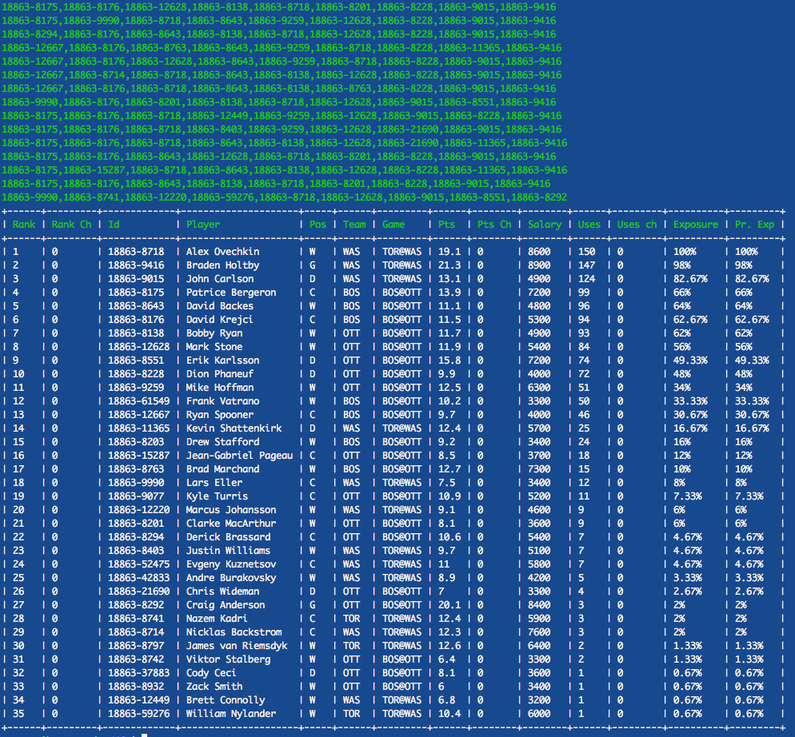

# DFS Fanduel Lineup Generator

Laravel DFS is a lineup generator for Fanduel.  It is in a semi-working state and you will have to wrestle to get it working for you, but it has the capability for NHL, NBA, and NFL.  

Capabilities include:
- merge and generate 1000s of lineups from multiple projections 
- generate lineups from different combinations of projections sources
- limit player exposure
- lock players
- stack teammates
- export for csv upload to Fanduel



## Getting Started

Clone the repo
```
git clone https://github.com/StuartFeldt/Laravel-DFS-Lineups.git
```

##### If any of the next four steps give you trouble, use Homestead
Install all dependencies
```
cd Laravel-DFS-Lineups
php composer.phar install
```

List all commands available to you
```
php artisan list
```

Copy `.env.example` to `.env`, modify it to your needs if necessary
```
cp .env.example .env
```

Create necessary tables in the database
```
php artisan migrate
```

#### Using Homestead
Using laravel's [Homestead](https://laravel.com/docs/5.3/homestead) is probably the easiest way to get this running for you.  It will give you the proper php version and install a database with credentials.

If you haven't used vagrant, install [VMWare](https://www.virtualbox.org/wiki/Downloads) and [Vagrant](https://www.vagrantup.com/downloads.html).

Install Homestead
```
cd ~
git clone https://github.com/laravel/homestead.git Homestead
cd Homestead

bash init.sh
```

Update `~/.homestead/Homestead.yaml` to look like:
```
---
ip: "192.168.10.10"
memory: 4096
cpus: 4
provider: virtualbox

authorize: ~/.ssh/id_rsa.pub

keys:
    - ~/.ssh/id_rsa

folders:
    - map: [~/path/to/Laravel-DFS-Lineups]
      to: /home/vagrant/dfs

databases:
    - homestead

variables:
    - key: APP_ENV
      value: local
```
Make sure you update the folders:map option to point to where you cloned Laravel-DFS-Lineups.

Bring up the box, and ssh into it
```
cd [~/Homestead]
vagrant up
vagrant ssh
```

Then continue from 'Install all dependencies' above


## NHL Example

Download a player's list from Fanduel for a contest you wish to enter, and move it to `dfs/storage/dfs`
```
cd [path/to/dfs]
mv ~/Downloads/fanduel_downloaded_players_list.csv ./storage/dfs
```

SSH into your homestead box
```
vagrant ssh
cd dfs
```

Add the slate anywhere in your `.env` file
```
SLATE=18863
```

Insert this into our database
```
php artisan dfs:insert:fd fanduel_downloaded_players_list.csv
```

You can get help for any command by appending `--help`
```
php artisan dfs:insert:fd --help
```

Create/download CSV of your projections in this format:
```
player1 name,projected points
player2 name,projected points
```

Insert those projections to the db
```
php artisan dfs:insert:proj --type=[type of projections these are, ex: my_proj] --filename=nhlrecent.csv --slate=18863
```

Generate Lineups from projections
```
php artisan dfs:generate:lineups [type of projections these are, ex: my_proj] [name for these projections, ex:my_proj_run_1] --sport=nhl
```

Retreive previously generated lineups
```
php artisan dfs:lus:get --type=[type of projections these are, ex: my_proj] --sport=nhl
```


### Other helpful commands
You can merge multiple projections sources into a projection type called `all_[slate]`
```
php artisan dfs:proj:merge
```

List all projection sets available for the current slate to generate lineups from
```
php artisan dfs:proj:list
```

### More Options and commands
```
dfs:custom:add        Add custom projection for an individual player
dfs:exclude           Completely exclude a player form consideration
dfs:feeds             Get Dfs feeds
dfs:generate:lineups  Generate Lineups (see below)
dfs:get               Get a player by name
dfs:get:pos           Get all players at a position
dfs:insert:fd         Insert fd player list
dfs:insert:proj       Insert projections
dfs:jobs:delete       Delete jobs queue
dfs:jobs:list         Get jobs queue
dfs:lus:get           Get Lineups (see below)
dfs:proj:list         List Projections Available
dfs:proj:merge        Merge projections
dfs:queue             queue gen lus
dfs:rg:get            Pull down RotoGrinders proj
dfs:update_lu_pts     Update lineups points
```

##### Generate Lineups
```
Usage:
  dfs:generate:lineups [options] [--] <type> <name>

Arguments:
  type
  name

Options:
      --lus[=LUS]           [default: "15"] // number of total lineups to return
      --randos[=RANDOS]     [default: "3"]  // Number of random lineups to add to lineups each generation round
      --seed[=SEED]         [default: "10"] // number of seed lineups to start with
      --rounds[=ROUNDS]     [default: "10"] // rounds of evolution
      --stack[=STACK]                       // stack teammates boolean
      --locks[=LOCKS]                       // player locks
      --max_pop[=MAX_POP]   [default: "100"] // max players in the breeding population
      --output
      --queue[=QUEUE]
      --sport[=SPORT]       [default: "nfl"]
  -h, --help               Display this help message
  -q, --quiet              Do not output any message
  -V, --version            Display this application version
      --ansi               Force ANSI output
      --no-ansi            Disable ANSI output
  -n, --no-interaction     Do not ask any interactive question
      --env[=ENV]          The environment the command should run under.
  -v|vv|vvv, --verbose     Increase the verbosity of messages: 1 for normal output, 2 for more verbose output and 3 for debug
```

##### Generate Lineups
```
Usage:
  dfs:lus:get [options]

Options:
      --num[=NUM]                                     [default: "10"] 	// number of lineups to print
      --type[=TYPE] 													// type of projections to use
      --excludes[=EXCLUDES] 											// player ids to exclude
      --locks[=LOCKS] 													// player locks
      --max_exposure[=MAX_EXPOSURE] 									// limit global max exposure for any player
      --players_max_exposure[=PLAYERS_MAX_EXPOSURE] 					// limit max exposure for given player 
      --players_min_exposure[=PLAYERS_MIN_EXPOSURE] 					// limit min exposure for given player
      --stack_rate[=STACK_RATE]                       [default: "0"]
      --double_stack_rate[=DOUBLE_STACK_RATE]         [default: "0"]
      --sport[=SPORT]                                 [default: "nfl"]
  -h, --help                                         Display this help message
  -q, --quiet                                        Do not output any message
  -V, --version                                      Display this application version
      --ansi                                         Force ANSI output
      --no-ansi                                      Disable ANSI output
  -n, --no-interaction                               Do not ask any interactive question
      --env[=ENV]                                    The environment the command should run under.
```